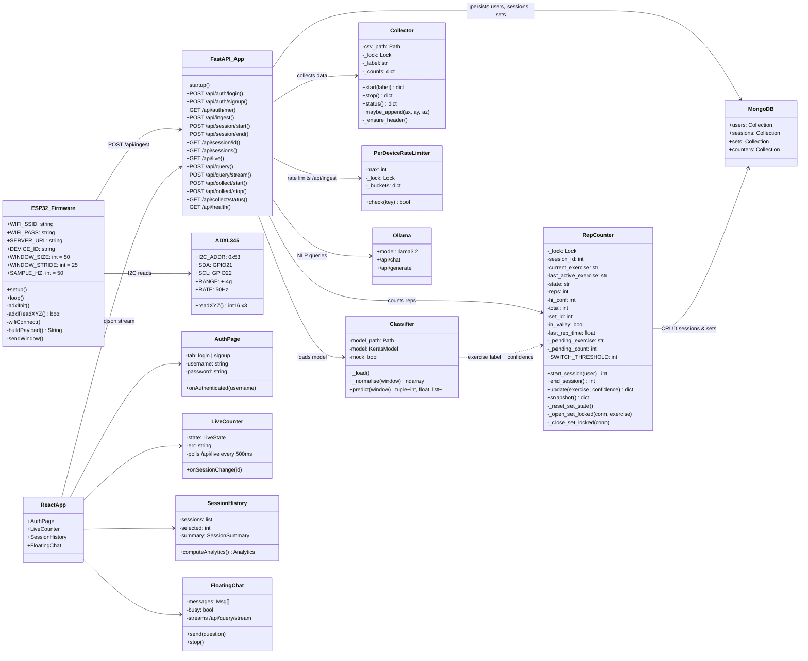
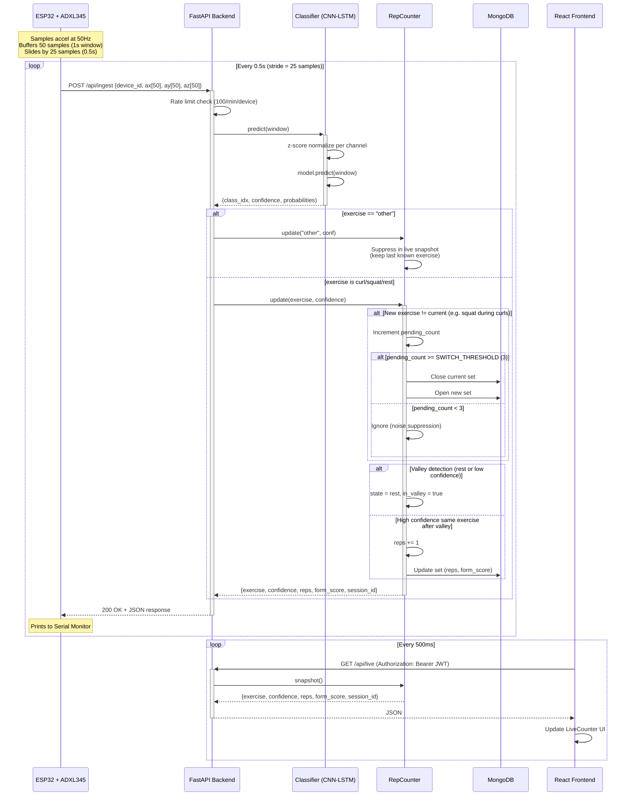
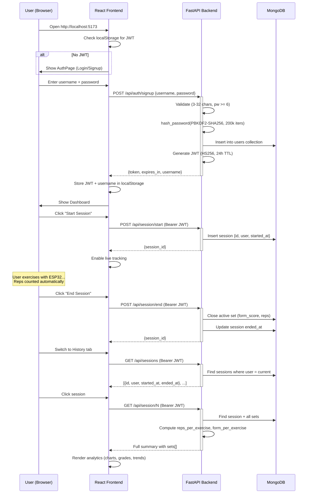
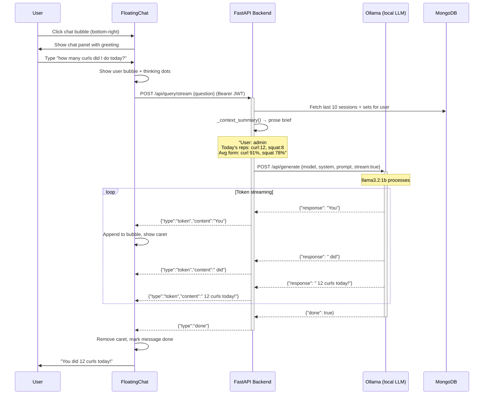
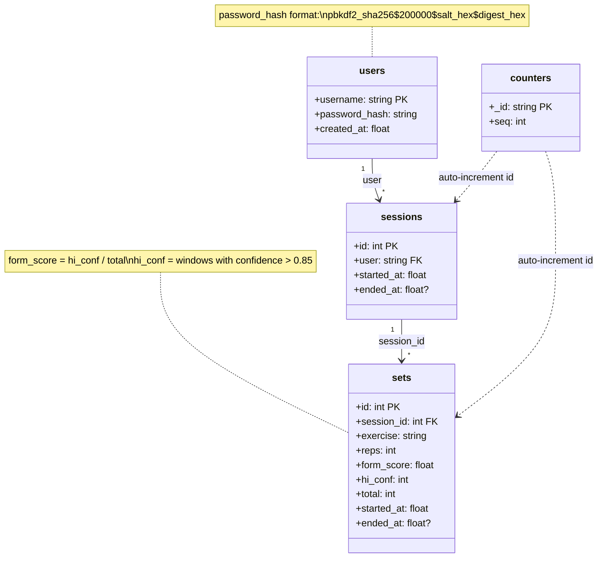

# GymTally — UML Diagrams

> Rendered automatically by GitHub. If viewing locally, paste into [mermaid.live](https://mermaid.live).

---

## 1. Class Diagram

---

## 2. Sequence Diagram — Real-time Rep Counting Flow

---

## 3. Sequence Diagram — Authentication + Session Lifecycle

---

## 4. Sequence Diagram — NLP Chat (Streaming)

---

## 5. Class Diagram — Data Model (MongoDB)

---

## 6. Component Diagram — Frontend

```mermaid
graph TB
    subgraph React App
        APP[App.tsx]
        AUTH[AuthPage.tsx]
        LC[LiveCounter.tsx]
        SH[SessionHistory.tsx]
        FC[FloatingChat.tsx]
        API[api.ts]
    end

    APP --> AUTH
    APP --> LC
    APP --> SH
    APP --> FC

    AUTH --> API
    LC --> API
    SH --> API
    FC --> API

    API -->|mock mode| MOCK[In-memory fake data]
    API -->|live mode| NGINX[nginx :5173]
    NGINX -->|/api/*| BACKEND[FastAPI :8001]

    SH --> RECHARTS[Recharts<br/>BarChart, PieChart, LineChart]
    FC --> NDJSON[ReadableStream<br/>ndjson parser]

    style MOCK fill:#374151,stroke:#6b7280
    style NGINX fill:#1e3a5f,stroke:#60a5fa
    style BACKEND fill:#1a3329,stroke:#22c55e
```

